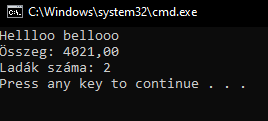

# Felhasználói dokumentáció

## Az alkalmazás célja
Járművek adatait olvassa be megadott csv formátumú fájlból

## telepités
A program VSC-ben fut

## inditas
 a telepiteshez töltse le a caros.zip fájlt, majd csomagolja ki.

## Inditás
A caros könyvtárban talál egy start.bat nevű fájl. A fájlkezelőben duplakattintással indul.

## A program használata
A program bevitel nélkül fut.

